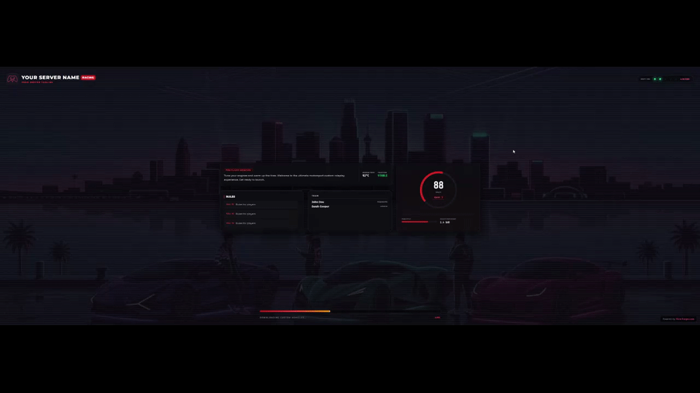

# Best FiveM Loading Screen 2026 - Cinematic Video

  

## 🚀 The Easiest Way to Customize

> [!IMPORTANT]
> **Want to upload your own YouTube video background without touching code?**  
> Use the visual builder at **[Vice-Forge.com](https://vice-forge.com)** to instantly customize this template with your own video, logo, and music. No HTML/CSS knowledge needed!

## ✨ Features
* 🎬 **Video Backgrounds:** Supports high-quality cinematic backgrounds.
* 📱 **Responsive UI:** Overlays scale perfectly.
* 🆓 **100% Free:** Download and use immediately.

## 🛠️ Manual Installation
1. Download this repository.
2. Place it in your server's `resources` folder.
3. Add `ensure best-fivem-loading-screen-2026` to `server.cfg`.

## 🔗 Other Top Rated Templates
* [Neon City Script](https://github.com/vice-forge/free-fivem-loading-screen-script)
* [Modern Glassmorphism](https://github.com/vice-forge/fivem-modern-loading-screen-free)
